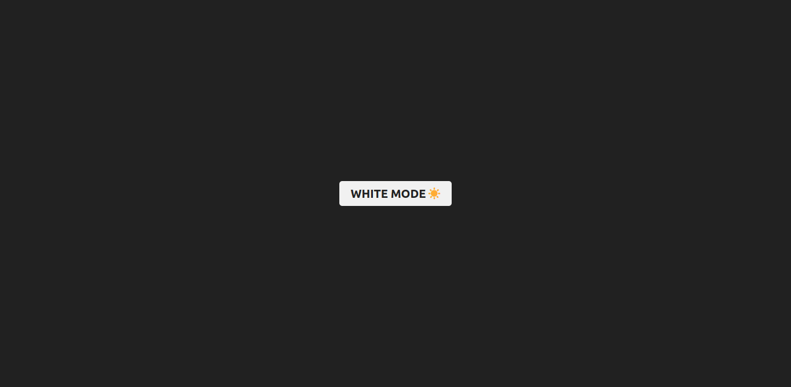

# day-04-in-30-days-of-react 

- in this project I make a basic transition from dark to light mode, using only the state hook (useState)
- and with this project I learned a little more about the use of hooks and styled-components (lib)

# result image  

